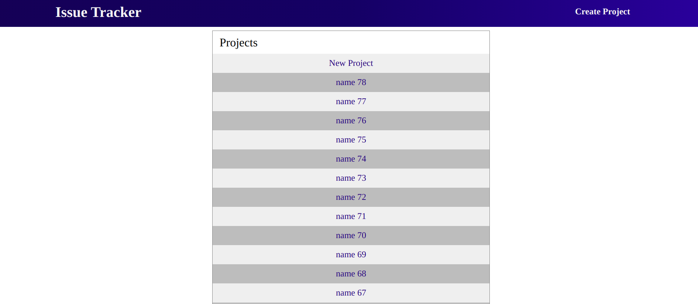
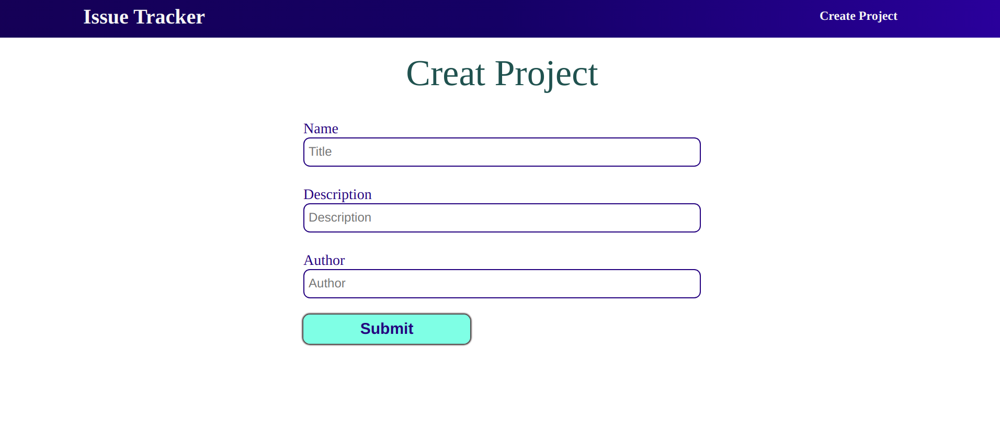
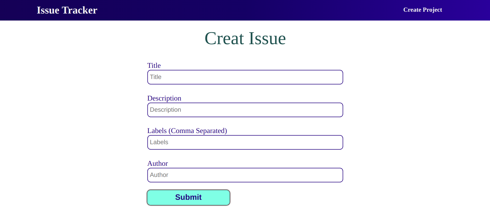
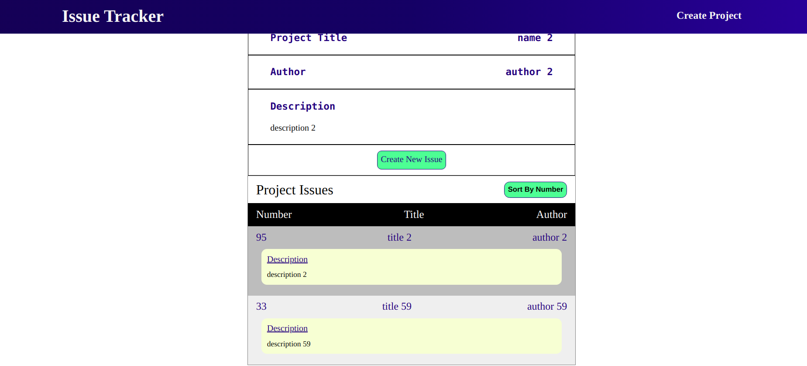
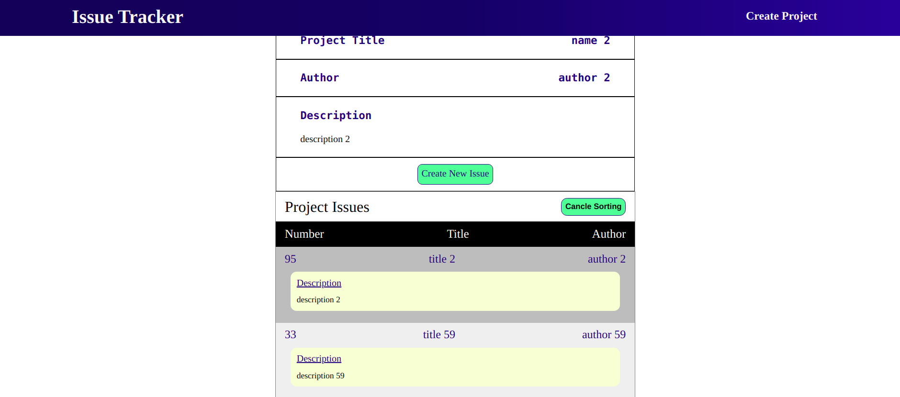

# Issue Tracker

# Preview

Hosted LInk : https://issue-tracker-bb645.web.app/






# Various Functionality

1. Adding New Project
2. Creating Issue Under Project
3. Sorting Issue
4. Getting Project Detail

# Techstack

### HTML, CSS, React

# Instructions to install

1. Clone this repository from https://github.com/dheerajk7/issue-tracker.git.
2. Install NPM if you have not installed yet.
3. Go to project directory and run these commands

   #### To install node Modules

   ```
   npm install
   ```

   #### To run project

   ```
   npm start
   ```

4. Go and check at http://localhost:3000

# Directory Structure

`/` - all react app files <br>
`/src` - all react app code files <br>
`/src/components`- all react components files <br>
`/src/services` - all API related services<br>
`/src/styles` - all CSS styles files <br>

---
